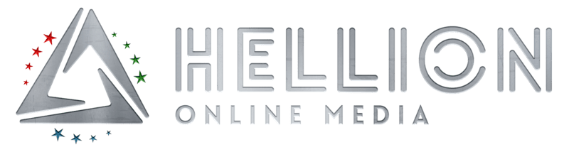
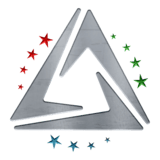

  

 

#  Jon Kazama

> Solo dev · Hellion Online Media
> Tea, wolves, atomic commits.

---

## About

Self-taught web dev based in Germany, running [Hellion Online Media](https://hellion-media.de) since 2021 — IT support, game-server hosting, and custom web work.

I learn by building real production stuff, breaking it, fixing it, then writing down what I missed so future-me doesn't have to figure it out twice.

---

<table>
<tr>
<td valign="top" width="50%">

### Daily stack

- Next.js 16, React 19
- TypeScript
- Prisma ORM + MySQL
- Sass / SCSS (external files only)
- C# · Dalamud (learning)

</td>
<td valign="top" width="50%">

### Tools & environment

- Nobara Linux + KDE Plasma
- VS Code
- Brave (primary)
- WireGuard for everything sensitive
- IIS + PM2 on Windows Server

</td>
</tr>
</table>

---

  
   
  <i>The unofficial modding & plugin arm of Hellion Online Media</i>

 

## Open-source projects

### [HellionChat](https://gitea.hellion-forge.cloud/JonKazama-Hellion/HellionChat)

C# · Dalamud — privacy-first FFXIV chat plugin

### [Hellion NewTab](https://gitea.hellion-forge.cloud/JonKazama-Hellion/Hellion-NewTab)

HTML · CSS · JS — local-first bookmark dashboard browser extension for Chrome, Edge, Brave, Opera, Vivaldi & Firefox

---

<b>Other ongoing work</b>

 

- **Hellion Initiative Webapp** — Next.js 16 management platform for my Star Citizen corp
- **Nova Corporation CMS** — Next.js 16 · Tailwind v4 · custom Page Builder
- **Hellion Power Tool** — WPF · PowerShell Windows maintenance utility

## Currently learning

C# on the side, the hard way, through FFXIV plugin work. Privacy-first defaults, atomic commits, transparent about where AI-pair tools fit in and where they don't.

## Off-keyboard

Running my Star Citizen corp, the **Hellion Initiative**, healing in FFXIV, and slowly turning my kitchen into a small apothecary of loose-leaf greens and blacks. Mildly obsessed with wolves while we're at it.

🐺 The wolf in question

 

  
   
  <i>Found in the wild. Possibly mine.</i>

---

> Plus the kind of documentation habit that makes coworkers either grateful or mildly concerned.

 

